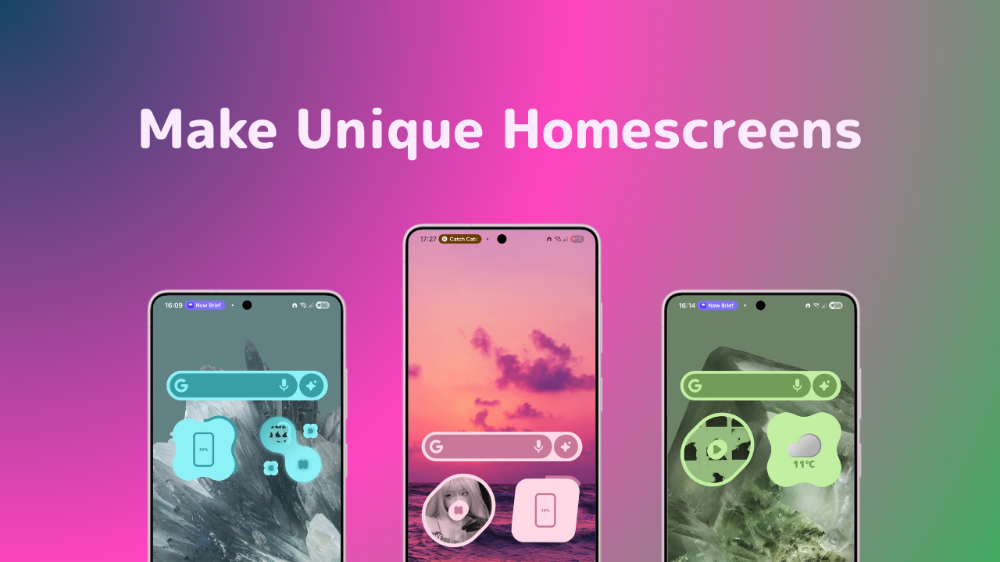
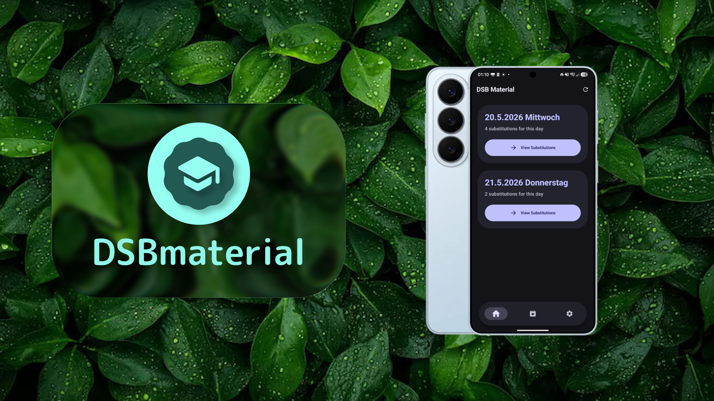
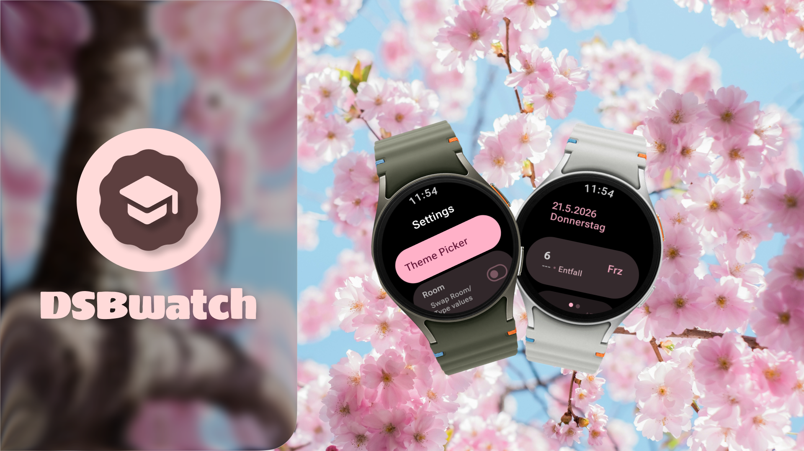

  

<h1 align="center">🌸 Konnichiwa, I'm Wolly! 🌸</h1>
<h3 align="center">✨ Designer and Developer from Germany ✨</h3>

  

## 🎀 About me
I Design graphics, Develop android apps and create Widgets with Kustom

- 🌟 Currently working on **DSBmaterial - Open Source, Modern Material You alternative to the offical DSBmobile app**
- 🌱 Currently learning **Android Development**
- 💞 Looking to collaborate on **---**
- 🍡 Fun fact: every new commit is a bug

## 💖 My Tech

<b>💻 Languages</b> &nbsp;(2)

 

 

<b>🎨 Styling</b> &nbsp;(2)

 

 

<b>☁️ DevOps & Cloud</b> &nbsp;(3)

 

  

<b>📱 Mobile</b> &nbsp;(1)

 

# 📱 My Apps & Projects

<b>YouShade Expressive</b> Widgets for KWGT inspired by Material Expressive

  
* [YouShade Repo](https://github.com/WollyDev24/YouShade)

<b>DSBmaterial</b> Open Source, material you alternative for the DSBmobile app

  
* [YouShade Repo](https://github.com/WollyDev24/DSBmaterial)

<b>DSBwatch</b> DSBmobile for your Wrist!

  
* [YouShade Repo](https://github.com/WollyDev24/DSBwatch)

## ⭐ My GitHub Adventures ⭐

  

---

